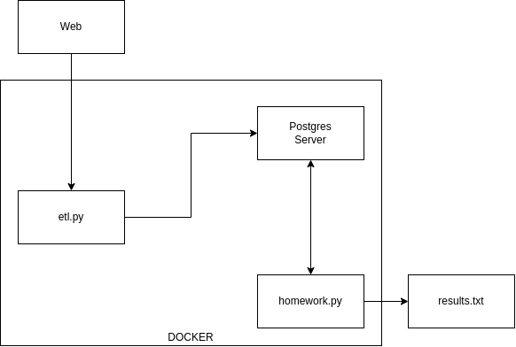

# Week 1: Docker and Terraform
`docker compose up` will create `results/results.txt` which contains the answers from question 3 to 6.

`docker compose down -v --rmi all`

In codespace `results/` was created by `root` so, to remove it: `sudo rm -rf results`

## Terraform

`terraform init`: Initialize terraform. Kind of like `git init`.
`terraform plan`: See the changes that will take place.
`terraform apply`: Apply the changes displayed in `terraform plan`. First `terraform plan` is run and then `terraform apply`.
`terraform apply --auto-approve`: Apply the changes without asking for confirmation.
`terraform destroy`: Remove/destroy/take down terraform managed infrastructure.

## Helpful links
- [Run pgadmin in codespace issue](https://github.com/orgs/community/discussions/17918)