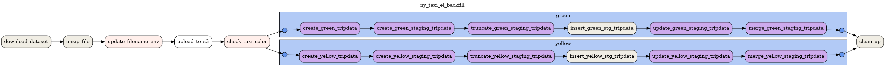
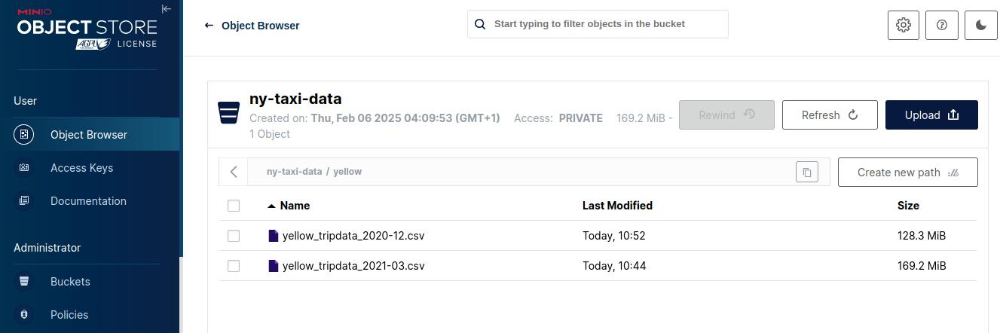

# About
Airflow was used to orchestrate.



The initial setup includes creating connections, varialbes and bucket.

## Running airflow
Run airflow
```
git clone https://github.com/TahirIshaq/data_eng_zoomcamp_2025.git
cd data_eng_zoomcamp_2025/week_2_orchestration
docker compose up -d
```
Once airflow webserver and scheduler are healthy login to: `localhost:8080` using the credentials:

| Key | Value |
| --- | --- |
| username | airflow |
| password | airflow |

## Creating connections
To configure the connection from UI. Go to `Admin/Connections/Add a new record(the + button)`, Here we need to configure 2 connections.

1. Postgres
2. S3

### Postgres

| Key | Value |
| --- | --- |
| Connection Id | db |
| Connection Type | Postgres |
| Host | db |
| Database | ny_taxi |
| Login | db_user |
| Password | db_pass |
| Port | 5432 |

### S3/Minio

| Key | Value |
| --- | --- |
| Connection Id | s3 |
| Connection Type | Amazon Web Services |
| AWS Access Key ID	 | admin |
| DatAWS Secret Access Key	abase | admin12345 |
| Extra | {"endpoint_url": "http://s3:9000"} |

## Creating Variables
To create variables via the UI, go to `Admin/Variables`. There are two ways to set the varialbes using the UI.
1. One by one
2. Bulk

### One by one
Select `Add a new record(the + button)` and add the varialble

### Bulk
Upload a JSON file by selecting `choose file` and then import varialbes.

To set the varialbes using JSON upload `helpers/ny_taxi_backfill_var.json`

## S3 Bucket
To create a bucket using the UI, login to `localhost:9001` and login using the following credentials:

| Key | Value |
| --- | --- |
| username | admin |
| password | admin12345 |

Then create a bucket `Object Browser/Create a Bucket`. In this case we name it `ny-taxi-data`.

## Running the DAG
The dags needs be run backfilling mode . To run the dag: 

1. Login to airflow schedular container, execute `docker exec -it scheduler /bin/bash` in the terminal or login using docker desktop.
2. `airflow dags backfill -s 2019-01-01 -e 2021-07-01 ny_taxi_el_backfill`
3. Generate the image: `airflow dags show ny_taxi_el_backfill`

The dag will run once a month.


## Homework

### Question 1:
1. Update/Set `taxi_color` variable to `yellow`
2. `airflow dags backfill -s 2020-12-01 ny_taxi_el_backfill`
3. The file size is **128.3 MB** 


### Question 2:
`green_tripdata_2020-04.csv`

### Question 3:
1. Update/Set `taxi_color` variable to `yellow`
2. `airflow dags backfill -s 2020-01-01 -e 2020-12-01 ny_taxi_el_backfill`
```
ny_taxi=# SELECT COUNT(1) AS "total_yellow_2020" FROM yellow_tripdata WHERE filename LIKE 'yellow%2020%';
 total_yellow_2020 
-------------------
          24648499
(1 row)
```

### Question 4:
1. Update/Set `taxi_color` variable to `green`
2. `airflow dags backfill -s 2020-01-01 -e 2020-12-01 ny_taxi_el_backfill`
```
ny_taxi=# SELECT COUNT(1) AS "total_green_2020" FROM green_tripdata WHERE filename LIKE 'green%2020%';
 total_green_2020 
------------------
          1734051
(1 row)
```

### Question 5:

1. Update/Set `taxi_color` variable to `yellow`
2. `airflow dags backfill -s 2021-03-01 ny_taxi_el_backfill`
```
ny_taxi=# SELECT COUNT(1) AS total_rows  FROM yellow_tripdata WHERE filename = 'yellow_tripdata_2021-03.csv';
 total_rows 
------------
    1925152
(1 row)
```

### Question 6:
Add a `timezone` property set to `AMerica/New_York` in the `Schedule` trigger configuration.
[source](https://kestra.io/docs/workflow-components/triggers/schedule-trigger)

In airflow the pendulum is used to set the timezone in start_date of DAG

## Notes
- Implement CSV to Postgres via `SQLExecuteQueryOperator` instead of bash.
- Need to test [S3ToSqlOperator](https://airflow.apache.org/docs/apache-airflow-providers-amazon/stable/_api/airflow/providers/amazon/aws/transfers/s3_to_sql/index.html#airflow.providers.amazon.aws.transfers.s3_to_sql.S3ToSqlOperator). Missing data of no text resulted in error and no all missing values were set to empty strings.
- How concurrent/parallel dags can be used to avoid deadlocks.
- Try external python environment to isolate tasks where their required packages might clash with airflows requirements.
- Try DLT/airbyte to transfer data from localsystem/S3 to postgres.